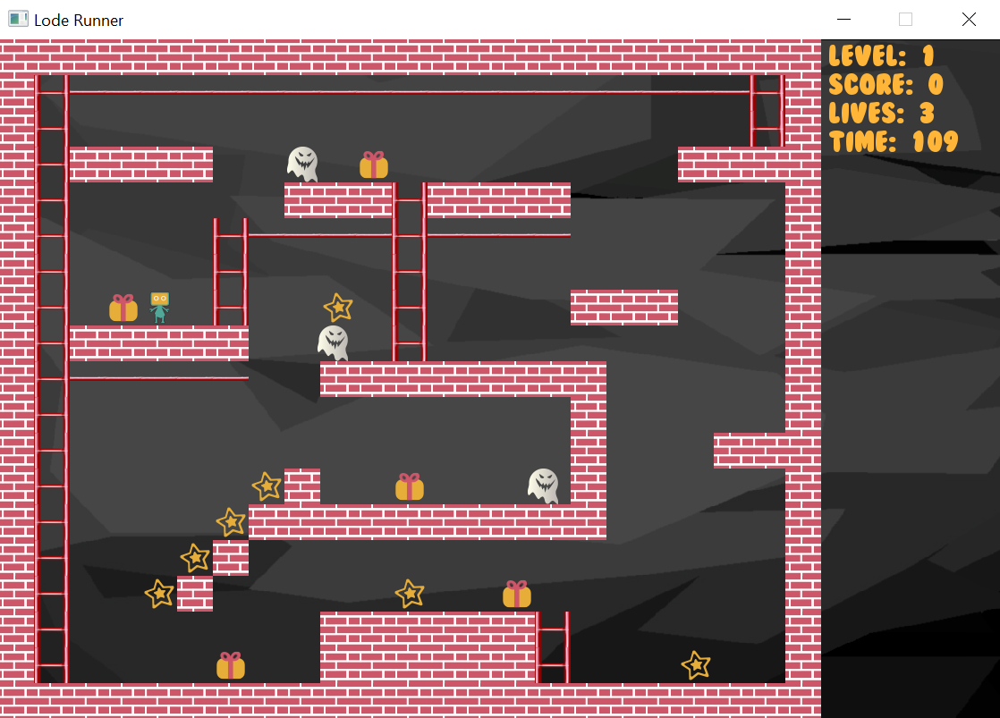
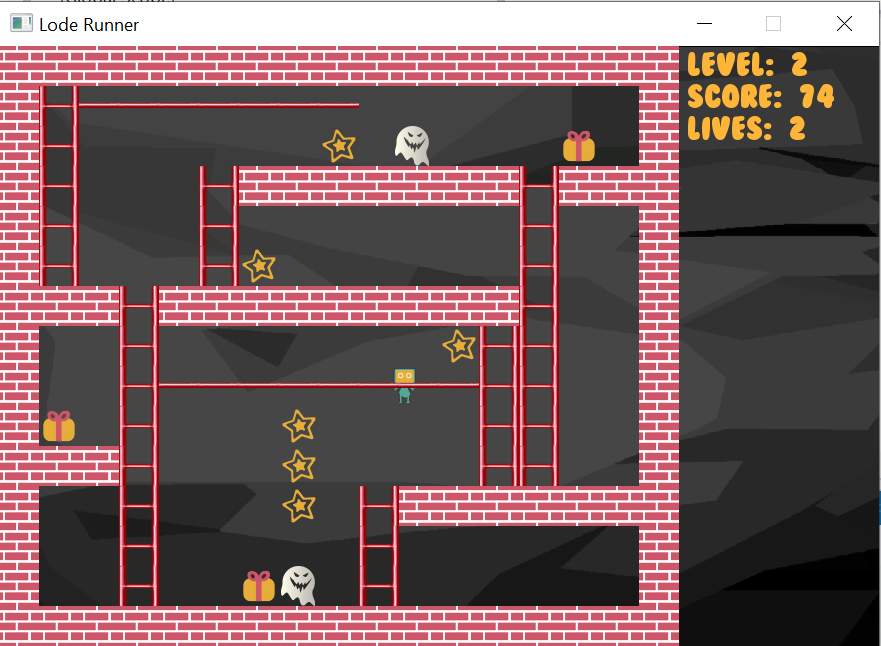
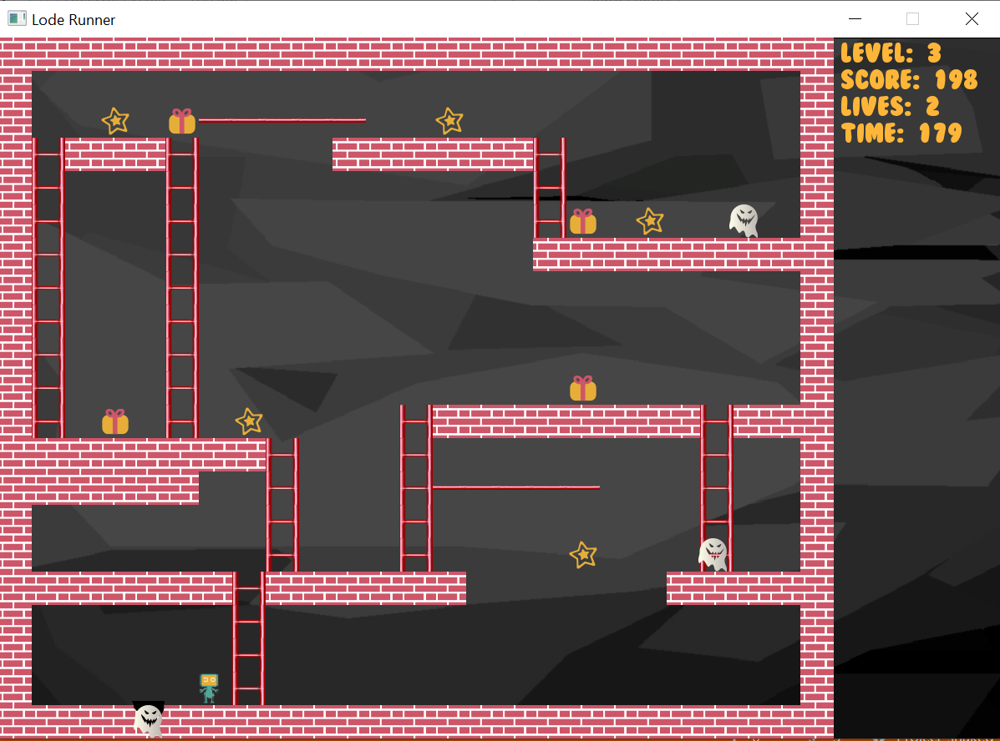

# Lode Runner Game
## Description
Implemention of the classic [Lode Runner](https://en.wikipedia.org/wiki/Lode_Runner) game written in C++.

The code uses class inheritance, polymorphism and the SFML library.

## Screenshots

